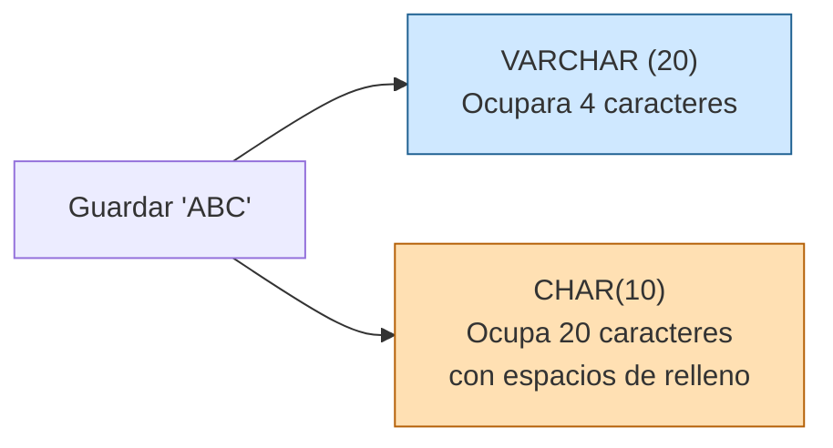
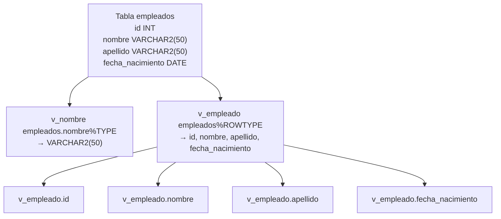
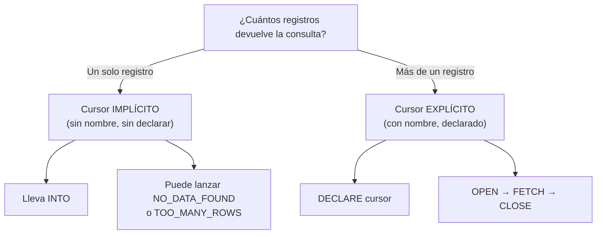
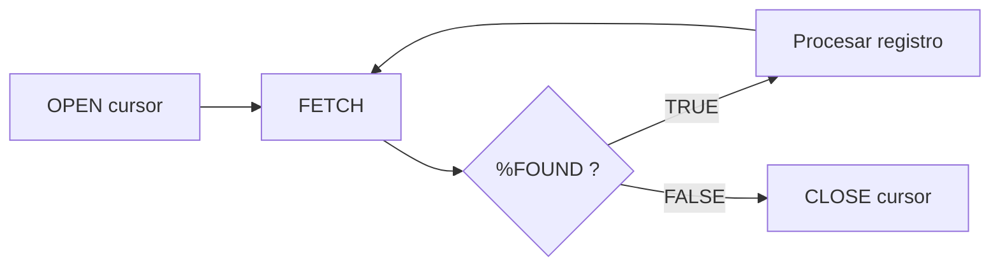
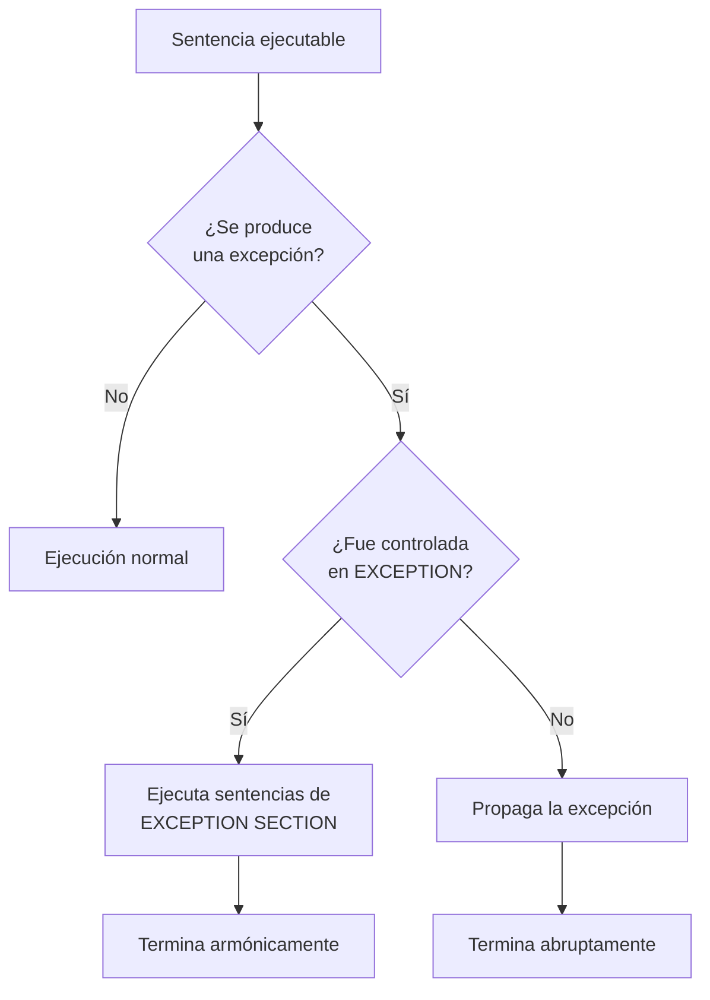
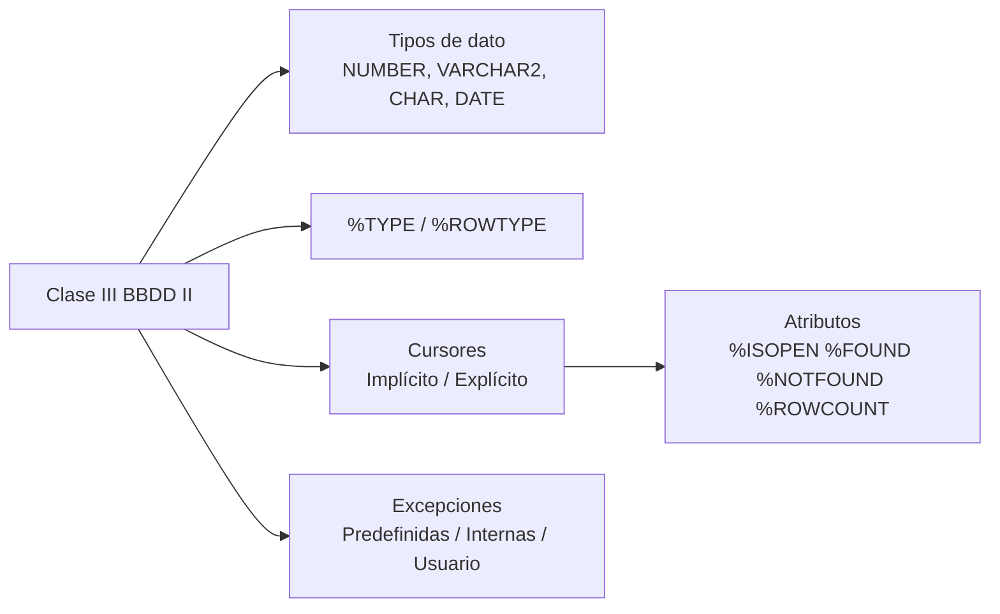

# Clase III — Bases de Datos II

> Apuntes sobre **Tipos de Datos**, **%TYPE / %ROWTYPE**, **Cursores** y **Excepciones** en PL/SQL.

---

## Tabla de contenidos

1. [Tipos de datos](#1-tipos-de-datos)
2. [Atributos %TYPE y %ROWTYPE](#2-atributos-type-y-rowtype)
3. [Cursores](#3-cursores)
4. [Atributos de los cursores](#4-atributos-de-los-cursores)
5. [Excepciones](#5-excepciones)

---

## 1. Tipos de datos

### 1.1. Tabla comparativa

| Tipo         | Parámetros                             | Descripción                                                             | Ejemplo                  |
|--------------|----------------------------------------|-------------------------------------------------------------------------|--------------------------|
| `NUMBER`     | `(cant_dígitos, cant_decimales)`       | Valores numéricos con precisión y escala.                               | `NUMBER(8,2)` → 123456.78 |
| `VARCHAR2`   | `(cant_máxima_caracteres)`             | Cadena de **tamaño variable**. Solo ocupa lo que se guarda.             | `VARCHAR2(50)`           |
| `CHAR`       | `(cant_caracteres)`                    | Cadena de **tamaño fijo**. Siempre ocupa el tamaño definido.            | `CHAR(10)`               |
| `DATE`       | —                                      | Formato `dd/mm/yyyy`. También guarda la **hora**.                        | `DATE`                   |

### 1.2. VARCHAR2 vs. CHAR



---

## 2. Atributos `%TYPE` y `%ROWTYPE`

Permiten definir variables **copiando la estructura** de un campo o de una tabla completa. Si la estructura cambia, la variable se adapta automáticamente en tiempo de ejecución.

### 2.1. Comparativa

| Atributo     | Copia                                   | Uso típico                                                 |
|--------------|-----------------------------------------|------------------------------------------------------------|
| `%TYPE`      | Estructura de **un campo**              | Una variable asociada a una columna específica.            |
| `%ROWTYPE`   | Estructura de una **tabla completa**    | Una variable que representa una fila completa.             |

### 2.2. Diagrama de uso



### 2.3. Ejemplo de declaración

```sql
DECLARE
    v_nombre    empleados.nombre%TYPE;
    v_apellido  empleados.apellido%TYPE;
    v_empleado  empleados%ROWTYPE;  -- Tendrá id, nombre, apellido y fecha_nacimiento
BEGIN
    -- v_empleado.id, v_empleado.nombre, etc.
    NULL;
END;
```

### 2.4. Uso como parámetros

```sql
CREATE OR REPLACE FUNCTION fn_prueba(v_empleado IN empleados%ROWTYPE)
RETURN ...;

CREATE OR REPLACE PROCEDURE sp_prueba(v_nombre IN empleados.nombre%TYPE)
AS ...;
```

---

## 3. Cursores

> **Definición:** un cursor es un **área de memoria privada** que contiene información procedente de una sentencia `SELECT`.

Los cursores son **obligatorios** para ejecutar sentencias DML (`SELECT`, `UPDATE`, `INSERT`, `DELETE`).

### 3.1. Árbol de decisión



### 3.2. Cursor implícito vs. explícito

| Característica           | Implícito                                       | Explícito                                  |
|--------------------------|-------------------------------------------------|--------------------------------------------|
| Cantidad de registros    | Exactamente **uno**                             | Uno o **varios**                            |
| ¿Tiene nombre?           | No                                              | Sí                                          |
| ¿Se declara?             | No                                              | Sí                                          |
| Cláusula especial        | `INTO`                                          | `OPEN` / `FETCH` / `CLOSE`                  |
| Prefijo de atributos     | `SQL%atributo`                                  | `nombre_cursor%atributo`                    |
| Excepciones típicas      | `NO_DATA_FOUND`, `TOO_MANY_ROWS`                | Se controlan con atributos (`%NOTFOUND`)    |

### 3.3. ¿Cuándo un `SELECT` devuelve como máximo una fila?

| Caso                                                        | Riesgo                                    |
|-------------------------------------------------------------|-------------------------------------------|
| `WHERE` filtrando por **clave primaria**                    | Puede no devolver registro (`NO_DATA_FOUND`) |
| `WHERE` filtrando por un campo **UNIQUE**                   | Puede no devolver registro (`NO_DATA_FOUND`) |
| Funciones de grupo sin `GROUP BY` (`MAX`, `MIN`, `COUNT`…)  | Siempre devuelve un valor (0 o >0)        |

### 3.4. Ejemplos

**Cursor implícito con `SELECT INTO`:**

```sql
DECLARE
    v_description VARCHAR2(50);
BEGIN
    SELECT description
      INTO v_description
      FROM countries
     WHERE country_id = 'ARG';  -- Acá se genera el cursor IMPLÍCITO

    DBMS_OUTPUT.PUT_LINE('La fila leída por el cursor es: ' || SQL%ROWCOUNT);
    DBMS_OUTPUT.PUT_LINE('La lectura del cursor es: ' || v_description);
END;
```

**Cursor implícito con `UPDATE`:**

```sql
BEGIN
    UPDATE countries
       SET description = 'Argentina'
     WHERE country_id = 'ARG';

    IF SQL%NOTFOUND THEN
        DBMS_OUTPUT.PUT_LINE('No se encontró registro alguno.');
    ELSE
        DBMS_OUTPUT.PUT_LINE('El registro se ha actualizado correctamente.');
    END IF;
END;
```

**Manejo de excepciones con `SELECT INTO`:**

```sql
EXCEPTION
    WHEN NO_DATA_FOUND THEN
        DBMS_OUTPUT.PUT_LINE('Ha ocurrido un error.');
```

---

## 4. Atributos de los cursores

> Sintaxis: **Explícito** → `nombre_cursor%atributo` · **Implícito** → `SQL%atributo`.

| Atributo       | Retorna                                                                              |
|----------------|--------------------------------------------------------------------------------------|
| `%ISOPEN`      | `TRUE` si el cursor está **abierto**.                                                |
| `%FOUND`       | `TRUE` si el registro se **procesó satisfactoriamente**.                             |
| `%NOTFOUND`    | `TRUE` si el registro **no pudo ser encontrado** (típicamente al agotar el cursor).  |
| `%ROWCOUNT`    | Número de registros **procesados hasta ese momento**.                                |



> El cursor **explícito se abre y cierra**; el **implícito se usa una vez y muere**.

---

## 5. Excepciones

> Las excepciones son el **manejo de errores** en PL/SQL. Se ubican después del bloque ejecutable (entre `BEGIN` y `END`). Se ejecuta **solo una** de las excepciones disponibles.

### 5.1. Estructura de un bloque con excepciones

```sql
BEGIN
    -- Código ejecutable
    -- Si hay error, finaliza en ese punto y salta a EXCEPTION
EXCEPTION
    WHEN NO_DATA_FOUND THEN
        DBMS_OUTPUT.PUT_LINE('No se encontraron datos.');
    WHEN STORAGE_ERROR THEN   -- Se interrumpe el programa acá si se lanza
        DBMS_OUTPUT.PUT_LINE('Error de almacenamiento.');
    WHEN OTHERS THEN          -- Cualquier otro error no contemplado arriba
        DBMS_OUTPUT.PUT_LINE('Ha ocurrido un error no identificado.');
END;
```

### 5.2. Categorías de excepciones

| Categoría                   | Código              | Nombre                 | Ejemplo                     |
|-----------------------------|---------------------|------------------------|-----------------------------|
| **Predefinidas**            | `ORA-00001`         | Con nombre             | `DUP_VAL_ON_INDEX`          |
| **Definidas internamente**  | `ORA-00060`         | Sin nombre             | (sin nombre asignado)       |
| **Definidas por el usuario**| —                   | Declaradas             | En la sección `DECLARE`     |

### 5.3. Flujo de control de una excepción



### 5.4. Uso de excepciones como condicionales

> *Controlar una condición de error: realizar una acción **solo si** la condición se cumple.*

**¿Si no existe un registro es un error?** No necesariamente: puedo usar la excepción `NO_DATA_FOUND` para **insertar** el registro si no existía.

```sql
BEGIN
    SELECT id INTO v_id
      FROM clientes
     WHERE dni = '12345678';
EXCEPTION
    WHEN NO_DATA_FOUND THEN
        -- El cliente no existía → lo insertamos
        INSERT INTO clientes (dni, nombre) VALUES ('12345678', 'Nuevo cliente');
END;
```

### 5.5. Excepciones frecuentes en cursores implícitos

| Excepción         | Se dispara cuando…                                                |
|-------------------|-------------------------------------------------------------------|
| `NO_DATA_FOUND`   | Ninguna fila de la tabla satisface la condición del `SELECT`.     |
| `TOO_MANY_ROWS`   | Más de una fila satisface la condición del `SELECT`.              |

---

## Resumen rápido


